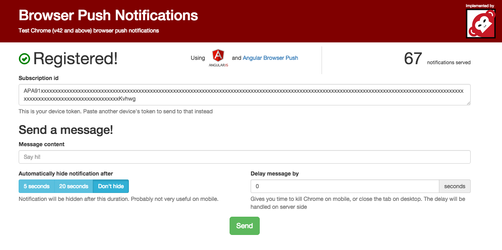
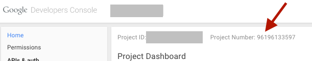
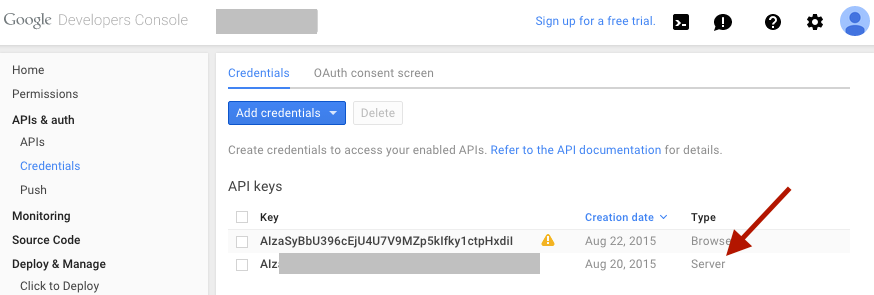

# Browser push notifications demo
Demo site for browser push notifications



Uses (Angular Browser Push Notifications)[https://github.com/matiboy/angular-browser-push-notifications]

### Usage

#### Clone the repo

```
 $ git clone https://github.com/matiboy/browser-push-notifications-demo.git
```

#### Install python requirements

```
 $ pip install -r requirements.txt
```

#### Install javascript requirements

```
 $ bower install
```

#### Run Redis

Currently expects redis to be on localhost at port 6379

```
 $ redis-server
```

#### Configure

Change the value of `"gcm_sender_id"` in `manifest.json` file to your Project number



#### Run

```
 $ GCM_TOKEN='your Google server key' python demo.py
```



##### Optional environment variables

- `FLASK_DEBUG=1`
- `FLASK_PORT=8888`

### Production environment

#### Secure environment

You may only register the service workers in "safe" environments, basically `localhost` and `https` domains

> Service workers require secure origins to ensure that the service worker script is from the intended origin and hasn’t come about from a man-in-the-middle attack. Currently, that means using HTTPS on live sites, though localhost will work during development

[Push Notifications on the Open Web](https://developers.google.com/web/updates/2015/03/push-notificatons-on-the-open-web)

If you decide to use a self signed certificate, users will need to fully trust that certificate before being able to allow notifications.

